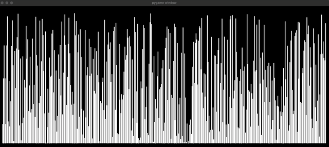

# Sorting Algorithms Visualized

---

## 🚀 Overview

This project visualizes common sorting algorithms using `pygame`.

I built it to learn how these algorithms work under the hood—and because I’ve always loved those hypnotic sorting videos on YouTube. So I made one myself.

## 🎥 Demo

These are my two favourite to look at

- **Merge Sort** | **Gravity Sort**
<p style="display: flex; align-items:center">
    
    
</p>

## ⚙️ Setup

### 📁 Project Structure

```plaintext
.
├── assets
│   └── demo
│       └── ...
├── README.md
├── requirements.txt
├── sorting_algos.py        # Sorting implementations + benchmarking
└── visualize.py            # Visualization logic and settings
```

### 📦 Dependencies

You’ll need:
- [`pygame`](https://www.pygame.org/wiki/GettingStarted)
- [`numpy`](https://numpy.org/)

Install them via:

```bash
pip install -r requirements.txt
```

### 🧪 Virtual Environment (Optional)

This is a lightweight project so there's no need for a virtual environment unless you want full isolation.

Here’s how to set one up:
```bash
# Create environment
python -m venv env

# Activate it
source env/bin/activate    # On Unix/macOS
# .\env\Scripts\activate   # On Windows

# Upgrade pip and install dependencies
pip install --upgrade pip
pip install -r requirements.txt

# When you're done
deactivate
```

## 🛠️ Usage

### 🔍 Visualize an Algorithm

1. Open `visualize.py`

2. Inside the `main()` function, configure `visualize(...)`:
    - Choose the sorting function from the available dictionary
    - Set `asc=True/False`
    - Choose a delay in milliseconds between sorting steps
    - Set array size
    - Toggle between a random array or evenly spaced values

3. Run the script:
```bash
python visualize.py
```

### ⏱️ Benchmark All Algorithms

The `sorting_algos.py` file includes:
- Individual implementations
- A quick benchmarking tool to test and compare performance on a random array of 10,000 elements

Run it with:
```bash
python sorting_algos.py
```

It will:
- Time each algorithm
- Print a ranked summary based on performance

## 🙏 Credits

- Inspired heavily by [Michael Sambol](https://www.youtube.com/@MichaelSambol) and his clear, intuitive visual explanations of sorting algorithms.


## Future Enhancements 

- Add more sorting methods
- Optimize existing ones 
- Improve the visual design
    - Better colours?
